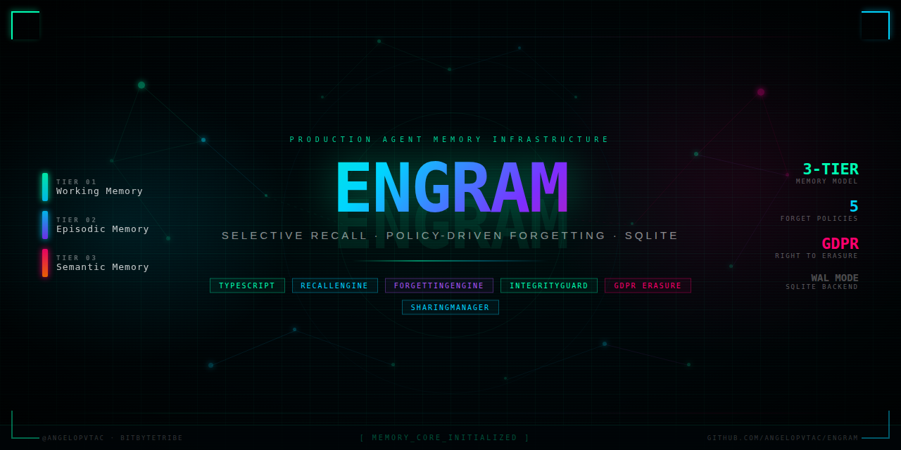

<p align="center">
  
</p>

<p align="center">
  <a href="#install">Install</a> &middot;
  <a href="#quick-start">Quick Start</a> &middot;
  <a href="#integrations">Integrations</a> &middot;
  <a href="#core-features">Core Features</a> &middot;
  <a href="#cli">CLI</a> &middot;
  <a href="docs/">Docs</a>
</p>

---

Engram gives AI agents a real memory system. Instead of losing context between conversations or stuffing everything into a prompt, agents get structured, queryable memory that persists, decays naturally, and stays compliant.

## Install

```bash
npm install engram
```

**Python SDK:**

```bash
pip install engram-sdk
```

## Quick Start

### TypeScript (Library)

```typescript
import { MemoryStore, RecallEngine, ForgettingEngine } from 'engram';

const store = new MemoryStore('~/.engram/memory.db');

// Store a short-lived note (working memory)
store.working.set('agent-1', 'current-task', 'reviewing PR #42', 300_000);

// Record something that happened (episodic memory)
store.episodic.store('agent-1', {
  who: 'user', what: 'Asked about deployment status',
  context: 'slack channel', outcome: 'Provided ETA',
  timestamp: Date.now(), visibility: 'private',
  expiresAt: null, metadata: {}
});

// Learn a fact (semantic memory)
store.semantic.store('agent-1', {
  fact: 'Production deploys happen on Tuesdays',
  topic: 'deployment', confidence: 0.9,
  sourceEpisodeIds: [], visibility: 'private', metadata: {}
});

// Semantic search across everything
const recall = new RecallEngine(store);
const results = await recall.recallAsync('deployment', { agentId: 'agent-1' });

store.close();
```

### Python

```python
from engram import EngramClient

client = EngramClient()  # connects to REST API at localhost:3847

client.store(
    tier="episodic",
    agent_id="agent-1",
    who="user",
    what="Asked about deployment status",
    context="slack channel",
    outcome="Provided ETA",
)

results = client.recall("deployment", agent_id="agent-1")
for mem in results.memories:
    print(f"[{mem.tier}] {mem.data}")
```

### MCP (Claude Code, etc.)

Add to your MCP client config:

```json
{
  "mcpServers": {
    "engram": {
      "command": "engram-mcp",
      "args": ["--db", "~/.engram/memory.db"]
    }
  }
}
```

Then use tools like `engram_store`, `engram_recall`, `engram_stats` from any MCP-compatible client.

### REST API

```bash
# Start the API server
engram-api --db ~/.engram/memory.db

# Store a memory
curl -X POST http://localhost:3847/api/v1/store \
  -H "Content-Type: application/json" \
  -H "Authorization: Bearer $ENGRAM_API_KEY" \
  -d '{"tier": "semantic", "agentId": "agent-1", "fact": "Deploys happen Tuesdays", "topic": "ops"}'

# Recall memories
curl -X POST http://localhost:3847/api/v1/recall \
  -H "Content-Type: application/json" \
  -H "Authorization: Bearer $ENGRAM_API_KEY" \
  -d '{"query": "deployment schedule"}'
```

API docs available at `http://localhost:3847/docs` when the server is running.

## Integrations

Engram exposes memory through four interfaces. Use whichever fits your stack:

| Interface | Best For | Transport |
|---|---|---|
| **TypeScript Library** | Direct Node.js integration | In-process |
| **MCP Server** | Claude Code, MCP-compatible agents | stdio |
| **REST API** | Language-agnostic, microservices | HTTP |
| **Python SDK** | Python agent frameworks (LangGraph, CrewAI, etc.) | HTTP (wraps REST API) |

## Use Cases

**Persistent agent context** -- Agents remember what happened in previous sessions without re-ingesting entire conversation histories. Working memory holds the current task; episodic memory captures what happened; semantic memory stores what was learned.

**Multi-agent collaboration** -- Teams of agents share relevant memories through visibility controls. One agent learns a fact, others on the same team can query it. Private memories stay private.

**GDPR-compliant data handling** -- When a user requests data erasure, one command purges their information from all memory tiers, quarantine, and audit logs. The audit trail itself is scrubbed of PII.

**Memory quality control** -- The integrity guard catches poisoned or contradictory writes before they enter the store. Suspicious memories are quarantined for review, not silently accepted.

**Context window management** -- Recall engine ranks memories by relevance, recency, confidence, and access frequency, then fits results within a token budget. Agents get the most useful context without blowing their prompt limit.

**Automatic memory decay** -- Forgetting policies handle the cleanup that agents shouldn't have to think about: expire stale data, demote low-confidence facts, delete memories nobody accesses.

## Core Features

### 3-Tier Memory Model

Memories are organized into three tiers that mirror how humans process information:

| Tier | What it stores | Lifespan | Example |
|---|---|---|---|
| **Working** | Current task state, scratch data | Minutes to hours (TTL-based) | `current-task: reviewing PR #42` |
| **Episodic** | Records of past events and interactions | Days to months | "User asked about billing on March 3" |
| **Semantic** | Learned facts, patterns, preferences | Long-term, confidence-scored | "Deploys happen on Tuesdays (90% confidence)" |

All tiers live in a single SQLite database (WAL mode). No external services required.

### Vector/Semantic Search

The `RecallEngine` supports two search modes:

- **Vector search** (default when an embedding provider is configured) — embeds the query and computes cosine similarity against stored memory embeddings. Finds semantically related memories even when keywords don't match.
- **Keyword fallback** — LIKE-based matching when no embedding provider is available.

Pluggable embedding providers:

| Provider | Dimensions | Dependencies | Use Case |
|---|---|---|---|
| **OpenAI** (`text-embedding-3-small`) | 1536 | API key | Production quality |
| **Local** (TF-IDF n-gram hashing) | 128 | None | Testing, offline, zero-cost |

Embeddings are stored alongside memories in SQLite as BLOBs. No separate vector database needed.

### Selective Recall

Results are ranked with a composite score:

- **Relevance** -- how well the memory matches the query (vector similarity or keyword match)
- **Recency** -- exponential decay with a configurable half-life (default: 7 days)
- **Confidence** -- for semantic facts, how sure we are it's true
- **Frequency** -- how often the memory has been accessed

Set a token budget and Engram returns the best memories that fit.

### Policy-Driven Forgetting

Five forgetting strategies, run on-demand or on a schedule:

| Policy | What it does |
|---|---|
| **Time-based** | Delete memories older than a TTL per tier |
| **Confidence-based** | Demote shaky facts to episodic; delete very low confidence |
| **Access-based** | Prune memories nobody has looked at in N days |
| **Explicit** | Delete everything matching a target string |
| **GDPR** | Full right-to-erasure: purges all tiers, quarantine, and audit logs |

### Integrity Guard

Validates writes before they hit the store:

- **Rate limiting** -- flags sudden write bursts (possible memory poisoning)
- **Contradiction detection** -- catches new facts that conflict with existing knowledge
- **Content validation** -- rejects empty or oversized entries
- Suspicious writes are **quarantined**, not silently dropped. Review and release them when ready.

### Cross-Agent Sharing

Memories have three visibility levels: `private`, `team`, and `public`. Working memory is always private. Episodic and semantic memories can be shared across agents on the same team or made globally visible.

### Audit Logging

Every memory operation is logged: stores, deletes, demotions, shares, revocations, quarantines. GDPR erasure scrubs audit entries too, leaving only an anonymized completion record.

## CLI

```bash
engram init --agent my-agent
engram store episodic "User reported billing bug" --who user --context support
engram store semantic "Billing bugs peak on Mondays" --topic billing --confidence 0.85
engram recall "billing issues" --tiers episodic,semantic
engram forget --policy gdpr --target "user@example.com"
engram stats
```

See [CLI reference](docs/cli.md) for all commands and options.

## Architecture

```
┌─────────────────────────────────────────────────┐
│          CLI / Library / MCP / REST API          │
├─────────┬──────────┬──────────┬────────┬────────┤
│ Recall  │ Forget   │Integrity │Sharing │Embed-  │
│ Engine  │ Engine   │  Guard   │Manager │dings   │
├─────────┴──────────┴──────────┴────────┴────────┤
│                  MemoryStore                     │
│  ┌─────────┬──────────┬──────────┐              │
│  │ Working │ Episodic │ Semantic │              │
│  │  (TTL)  │ (events) │ (facts)  │              │
│  └─────────┴──────────┴──────────┘              │
├─────────────────────────────────────────────────┤
│        SQLite (WAL mode) + Embeddings           │
└─────────────────────────────────────────────────┘
```

## Documentation

| Doc | Description |
|---|---|
| [API Reference](docs/api.md) | Library methods, REST endpoints, MCP tools |
| [CLI Reference](docs/cli.md) | All commands, flags, and examples |
| [Forgetting Policies](docs/forgetting.md) | Deep dive into each policy type with configuration examples |
| [Sharing & Visibility](docs/sharing.md) | Cross-agent memory sharing and access control |
| [Integrity & Quarantine](docs/integrity.md) | Write validation, contradiction detection, quarantine workflow |

## Development

```bash
npm run build      # Compile TypeScript
npm test           # Run tests (vitest) — 131 tests
npm run dev        # Watch mode
npm run lint       # Type-check
npm run mcp        # Start MCP server (stdio)
npm run api        # Start REST API server (port 3847)
```

## License

MIT
